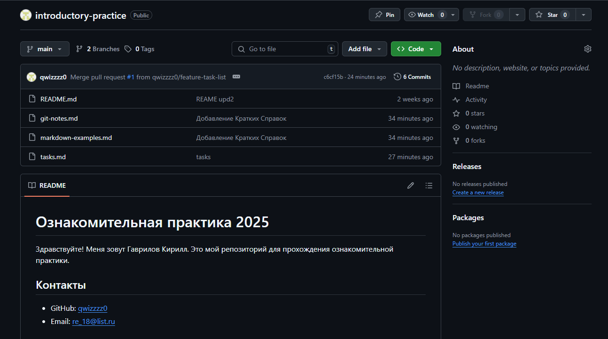

# Федеральное государственное бюджетное образовательное учреждение высшего образования  
# «Российский государственный социальный университет»  

## ОТЧЕТ ОБУЧАЮЩЕГОСЯ О ПРОХОЖДЕНИИ ПРАКТИКИ  
**Период:** с «27» мая 2025 г. по «9» июня 2025 г.  
**Вид практики:** Ознакомительная практика  

**Обучающийся:** Гаврилов Кирилл Алексеевич  
(ФИО)  

**Факультет/филиал/колледж РГСУ:** Экономика и управление  
**Кафедра:** Экономика Финансы и Капитал  

**Направление подготовки/специальность:** Бизнесс-Аналитика  
**Курс:** 1 **Форма обучения:** Очная 
**Учебная группа:** БИЗ-Б-0-Д-2024-1 **Номер зачетной книжки:** 690779 

---

## Содержание отчета

### Введение  

### 1. Краткое описание выполненных заданий

#### 1.1 Знакомство с Git и Markdown
**Выполненные задания:**  
- Установка __Git__ на локальный компьютер  
- Регистрация на _GitHub_  
- Настройка профиля и безопасности аккаунта  
- Создание SSH-ключа и подключение к _GitHub_  
- Создание личного репозитория __introductory-practice__ 
- Клонирование репозитория на локальный компьютер  
- Первый коммит с файлом `README.md`
- Отправка изменений в удаленный репозиторий  

**Описание процесса:**  
1. Установил __Git__, зашел в уже ранее созданный аккаунт Github. 
2. Создал SSH ключ через терминал __VS Code__ и привязал к профилю. 
3. Создал личный репозиторий. 
4. Клонировал его на компьютер с помощью команды `git clone`. 
5. Изменил файл README.md и закомитил. 
6. Никаких проблем не было.

#### 1.2 Практика работы с Git и Markdown
**Выполненные задания:**  
- Создание файла `git-notes.md` со справочником команд __Git__  
- Создание файла `markdown-examples.md` с примерами Markdown  
- Создание ветки `feature-task-list`  
- Добавление файла `tasks.md` со списком задач  
- Слияние ветки через __Pull Request__  

**Описание процесса:**  
- Взял информацию из интернета с командами __Git__ и создал справочник.
- Также взял информацию из прикрепленного справочника по Markdown и создал файл с примерами.
- Создал ветку с помощью `git branch feature-x`
- Добавил файл со списком задач
- Сделал __Pull Request__

#### 1.3 Групповая работа с Git
**Выполненные задания:**  
- Создание группового репозитория `team-project-222`
- Выполнение форка репозитория  
- Внесение изменений и отправка __Pull Request__  
- Обсуждение и принятие/отклонение изменений участников  
- Создание файла `CONTRIBUTING.md`  

**Состав группы:**  
- Гаврилов Кирилл
- Клюева Алиса
- Жаховский Игорь
- Миниханов Рафаэль

**Описание процесса:**  
1. Устроили онлайн встречу для распределения обязанностей 
2. После распределения принялись каждый писать свою часть кода
3. По мере поступления проблем старались помочь друг другу

---

### 2. Ссылки на репозитории
**Личный репозиторий:**  
[Ссылка](https://github.com/qwizzzz0/introductory-practice)

**Описание содержимого:**  
- __README.md__ -  описание репозитория
- __git-notes.md__ - справочник команд для __Git__
- __markdown-examples.md__ - примеры использования __Markdown__  

**Групповой репозиторий:**  
[Ссылка](https://github.com/newcivetik/team-project-222)  

**Описание проекта:**  
Консольное приложения для генерирования паролей

**Мой вклад:**  
- Написал тесты для проверки __strict__ алгоритма генерации (убедился, что он действительно добавляет хотя бы один символ из каждого набора).
- Написал тесты для проверки сохранения и загрузки настроек.
- Убедился, что все тесты проходят успешно.

---

### 3. Анализ приобретенных навыков

#### Технические навыки:
- Работа с Git/GitHub (клонирование, ветки, коммиты, пул-реквесты)
- Использование Markdown для документации
- Настройка рабочего окружения

#### Soft Skills:
- Командная работа и распределение задач
- Проведение код-ревью
- Самоорганизация и тайм-менеджмент

---

### 4. Скриншоты выполненных заданий

#### Личный репозиторий
  

#### Пример Pull Request
  

#### Работа в IDE
  

---

### 5. Трудности и их преодоление
**Технические трудности:**  
- Проблема: Не клонировался Репозиторий  
- Решение: Создали SSH ключ  
- Опыт: Узнали, что при вводе _passphrase_ символы не видно

**Организационные трудности:**  
- Проблема: Не могли собраться вместе
- Решение: Поставили четкое время и дату встречи
- Опыт: Научились находить компромиссы и распределять задачи

---

### 6. Заключение о практике
**Достигнутые цели:**  
- Создали генератор паролей
- Научились базовым основам пользованием __Git__

**Практическая значимость:**  
- Поняли сущность профессии

**Рекомендации по улучшению:**  
- Нет

**Общее впечатление:**  
- Было трудно, но интересно

---

### Подписи:
**Руководитель практики от организации:**  
_______________________ / _______________________  
(подпись) (ФИО)  
"___" ___________ 20___ г.  

**Руководитель практики от РГСУ:**  
_______________________ / _______________________  
(подпись) (ФИО)  
"___" ___________ 20___ г.  

М.П.
